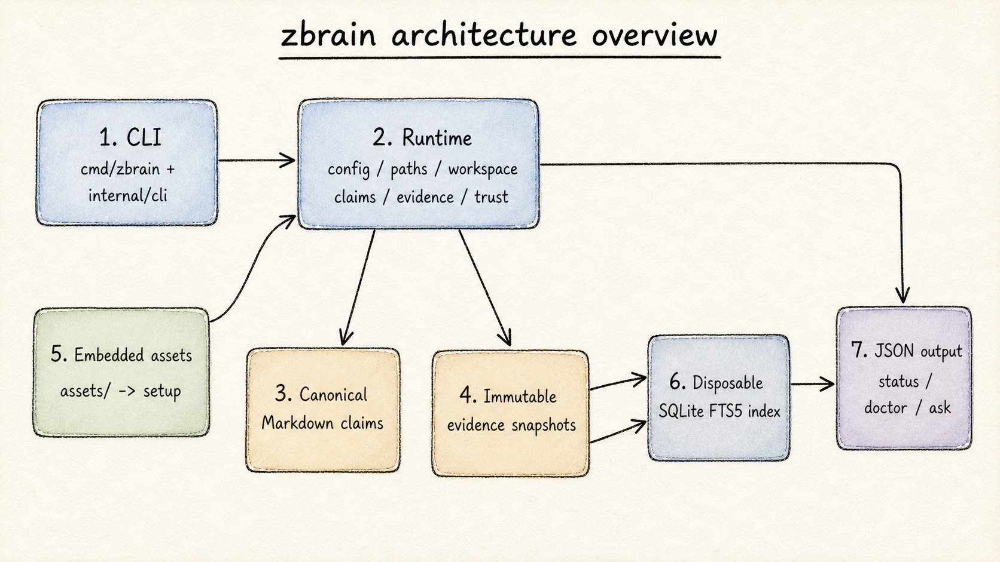
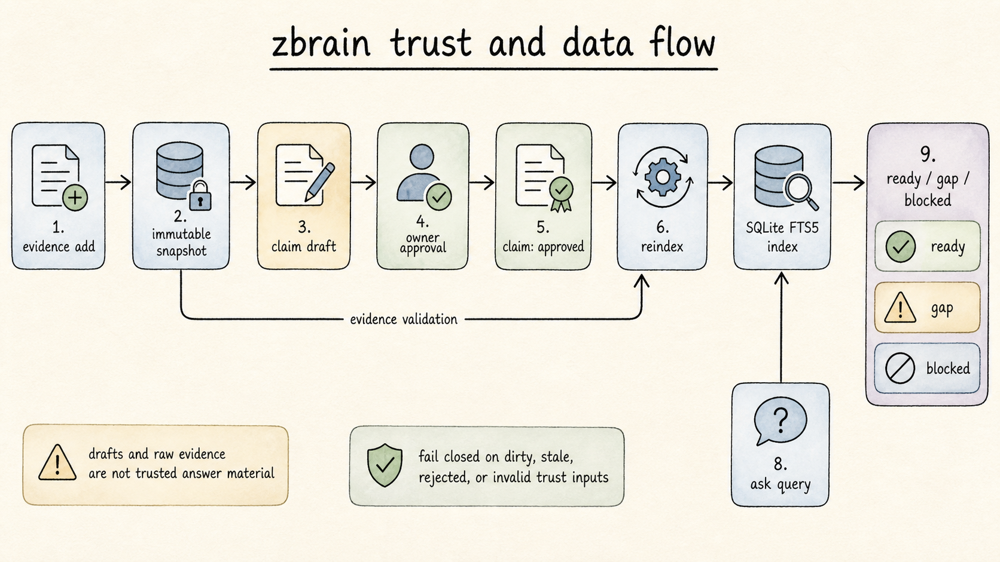

# zbrain

`zbrain` is a Go-native CLI for local-first trusted memory and
workspace-isolated agent context.

The shipped runtime keeps canonical OKF-style Markdown claims and immutable
local evidence snapshots, builds a disposable SQLite FTS5 index, and returns
trusted context JSON. It does not call an LLM or model provider.

[MIT license](LICENSE) · [Contributing](CONTRIBUTING.md) ·
[Changelog](CHANGELOG.md)

## Features

- Workspace-isolated memory rooted at `~/.zbrain/` or `ZBRAIN_HOME`.
- OKF-style claim concepts in the `axioms`, `mental-models`, `projects`, and
  `decisions` tiers.
- Explicit claim lifecycle: `draft -> approved -> superseded|revoked`.
- Immutable local evidence snapshots with origin, capture time, media type,
  byte length, and SHA-256 metadata.
- Rebuildable per-workspace SQLite FTS5 lexical indexes.
- Fail-closed trusted retrieval with visible `ready`, `gap`, and `blocked`
  outcomes.
- `status` and `doctor` diagnostics for index and embedding configuration.
- Embedded runtime assets extracted by `zbrain setup`.

## Architecture

The CLI keeps argument parsing and output at the edge. Durable behavior lives
in `internal/runtime/`; Markdown and evidence are canonical, while SQLite is a
derived cache that can be discarded and rebuilt.



*Architecture overview: CLI, runtime packages, canonical inputs, embedded
assets, disposable index, and JSON outputs.*



*Trust flow: evidence capture, claim approval, rebuild validation, and trusted
query outcomes.*

### Trust and data flow

1. `evidence add` copies an already-local file into an immutable evidence
   snapshot and records its metadata.
2. `claim draft` writes an OKF claim candidate. The claim body is read from
   stdin; drafts are never trusted answer material.
3. `claim approve` validates the claim basis and referenced evidence or
   supporting claims, then records `verified.at`, `verified.by`, and
   `verified.digest`.
4. `reindex` scans canonical Markdown and evidence, validates trust inputs, and
   publishes a clean or rejected disposable index without rewriting canonical
   files.
5. `ask` checks index freshness and the returned claim's canonical binding and
   trust dependencies before returning JSON. Conflicts produce `blocked`; no
   matching approved claim produces `gap`.

### Shipped runtime versus proposed integrations

The shipped binary is standalone and Go-native. The current command surface
does not include `zbrain mcp serve` or `zbrain view`; those are authorized
future gateway/viewer milestones described in
[`trusted-memory-spec.md`](trusted-memory-spec.md) and
[`docs/trusted-agent-gateway-spec.md`](docs/trusted-agent-gateway-spec.md).

## Repository structure

```text
cmd/zbrain/         CLI binary entrypoint
internal/cli/       command dispatch and user-facing behavior
internal/runtime/   paths, config, assets, workspaces, claims, evidence,
                    trust validation, index, and query
assets/             embedded runtime content copied by setup
docs/               current supporting docs, diagrams, and durable plans
```

## Prerequisites

- Go 1.24 or newer.
- SQLite with FTS5 support is provided by the Go SQLite dependency; no external
  database or retrieval service is required.

## Installation

Install the latest published binary:

```bash
go install github.com/therealtinhtute/zbrain/cmd/zbrain@latest
zbrain setup
```

For local development:

```bash
git clone <repo>
cd zbrain
export ZBRAIN_HOME=/tmp/zbrain-dev
go run ./cmd/zbrain setup
```

## Configuration

`ZBRAIN_HOME` overrides the runtime root. Without it, the default is
`~/.zbrain/`. Use it for tests, smoke runs, and isolated experiments:

```bash
ZBRAIN_HOME=/tmp/zbrain-dev go run ./cmd/zbrain setup
```

`zbrain setup` creates `config.yml` when needed. The first
`workspace create <name>` sets `default_workspace`; later commands use that
workspace unless they receive `--workspace <name>`.

Runtime layout after setup and `workspace create research`:

```text
<ZBRAIN_HOME>/
  config.yml
  README.md                  # extracted runtime asset
  agents/
  engine/
  skills/
  templates/
  indexes/
    research.sqlite          # disposable SQLite FTS5 index
    research.dirty           # present while rebuild is incomplete
  workspaces/
    research/
      workspace.md
      agents/
      wiki/
        axioms/
        mental-models/
        projects/
        decisions/
      evidence/
        _index.md
        sources/<evd_id>/
          raw
          source.yaml
        analysis/
        qa/
        applied/
        archive/
```

`setup` extracts `README.md`, `agents/`, `engine/`, `skills/`, and `templates/`
from the embedded `assets/` filesystem. It does not activate a workspace seed;
`workspace create` creates the selected workspace and `reindex` creates its
disposable index.

## Local usage

Show the complete shipped command surface:

```bash
go run ./cmd/zbrain --help
```

Commands:

```text
zbrain setup
zbrain workspace create <name>
zbrain workspace current
zbrain evidence add --file <path> --origin <uri-or-path> [--media-type <type>] [--workspace <name>]
zbrain claim draft --tier <tier> --title <title> --basis <owner|evidence|derived> [--evidence <id>]... [--support <id>]... [--conflicts-with <id>]... [--workspace <name>]
zbrain claim approve <id> [--workspace <name>]
zbrain claim supersede <id> --tier <tier> --title <title> --basis <owner|evidence|derived> [--evidence <id>]... [--support <id>]... [--conflicts-with <id>]... [--workspace <name>]
zbrain claim revoke <id> --reason <text> [--workspace <name>]
zbrain migrate okf [--workspace <name>]
zbrain reindex [--workspace <name>]
zbrain ask [--workspace <name>] [--include <name>]... <query>
zbrain status [--workspace <name>]
zbrain doctor [--workspace <name>] [--probe-embedder]
zbrain version
```

Create an isolated workspace and capture evidence:

```bash
export ZBRAIN_HOME=/tmp/zbrain-dev
go run ./cmd/zbrain setup
go run ./cmd/zbrain workspace create research
go run ./cmd/zbrain workspace current
go run ./cmd/zbrain evidence add \
  --file ./notes.txt \
  --origin file://notes.txt \
  --media-type text/plain
```

Create a claim from stdin, approve it, rebuild, and query it:

```bash
claim_json=$(printf 'The local source is authoritative.\n' | \
  go run ./cmd/zbrain claim draft \
    --tier projects \
    --title 'Source authority' \
    --basis owner)
claim_id=$(printf '%s' "$claim_json" | python3 -c \
  'import json,sys; print(json.load(sys.stdin)["id"])')
go run ./cmd/zbrain claim approve "$claim_id"
go run ./cmd/zbrain reindex
go run ./cmd/zbrain status
go run ./cmd/zbrain ask authoritative source
```

Evidence-based claims must pass an evidence ID from `evidence add` using
`--evidence`. Derived claims must reference approved supporting claims or
verified evidence. `--include <name>` adds an explicit read-only secondary
workspace; it is never implicit.

Use `migrate okf` for legacy `schema: zbrain.claim/v1` files. It reports
whether reapproval is required; migration does not silently make an old
approval trusted.

## Trust model

Trusted claims are OKF-style Markdown documents with:

```yaml
type: zbrain.claim
zbrain:
  profile: zbrain.trusted-memory/v1
  id: clm_<32 lowercase hex characters>
  tier: axioms | mental-models | projects | decisions
  basis: owner | evidence | derived
status: draft | approved | superseded | revoked
```

- `zbrain.id` is the stable trust identity; the path is not the identity.
- Approved claims are replaced through supersession, not in-place editing.
- Only valid `approved` claims enter trusted results.
- Drafts are returned, when matched, only as `promotion_candidates`.
- Approved claims carry a verification digest over their canonical rendered
  content.
- Evidence snapshots are immutable local copies; raw evidence is not indexed or
  treated as trusted instructions.
- `reindex` rejects invalid claims, invalid evidence, broken supporting-claim
  closures, and stale or legacy-unindexed trust inputs without rewriting them.
- `ask` fails closed for dirty, missing, stale, or rejected indexes.
- Explicit claim conflicts return `status: "blocked"`; no matching trusted
  claim returns `status: "gap"`.

## Testing

Run the repository's standard gates from the project root:

```bash
go test ./...
go vet ./...
make build
make smoke
```

The smoke target uses an isolated temporary `ZBRAIN_HOME`. Useful additional
checks are:

```bash
go test -race ./internal/runtime ./internal/cli
ZBRAIN_BENCH_100K=1 go test ./internal/runtime -run '^TestAskP95At100K$' -count=1 -v
```

Check every documented command group directly:

```bash
go run ./cmd/zbrain --help
go run ./cmd/zbrain workspace --help
go run ./cmd/zbrain evidence --help
go run ./cmd/zbrain claim --help
go run ./cmd/zbrain migrate --help
go run ./cmd/zbrain reindex --help
go run ./cmd/zbrain ask --help
go run ./cmd/zbrain status --help
go run ./cmd/zbrain doctor --help
```

## Build and deployment

Build a standalone binary with:

```bash
make build
./dist/zbrain --help
```

The binary embeds runtime assets; deployment needs no JavaScript runtime,
package manager, hosted database, network crawler, or model provider. Run
`zbrain setup` on the target machine to extract its assets into that machine's
runtime root. Keep runtime data outside the repository and do not package
populated personal workspaces or credentials.

## Troubleshooting

- `no default workspace configured`: run `zbrain workspace create <name>`.
- `index does not exist`, `index is dirty`, `index is stale`, or `index is
  rejected`: run `zbrain reindex`, then inspect `zbrain status` and
  `zbrain doctor`.
- `doctor` reports domain findings with exit code `2`; its JSON includes
  `findings` and `next_action`.
- A `gap` is a trusted-memory miss, not permission to use drafts or raw
  evidence. Add or approve a valid claim, then reindex.
- A `blocked` result means the matched approved claims contain an explicit
  conflict; resolve it through the claim lifecycle.
- If `ZBRAIN_HOME` is set, every command in the session must use the same value
  to inspect the same runtime.

## Limitations

The current slice is intentionally local and minimal. It has no hosted sync,
network crawling, background service, GUI editor, remote or HTTP MCP
transport, vector database, semantic-search requirement, session transcript
store, or model-provider integration. Proposed MCP and viewer work must remain
behind the separately authorized milestones and preserve the fail-closed
runtime contract.

## Contributing

Read [CONTRIBUTING.md](CONTRIBUTING.md) before opening a change. Keep command
handlers thin, put durable behavior in `internal/runtime/`, preserve `assets/`
as the embedded runtime source of truth, and run the relevant Go, build, smoke,
and documentation checks before submitting.

## License

zbrain is MIT-licensed. See [LICENSE](LICENSE).
